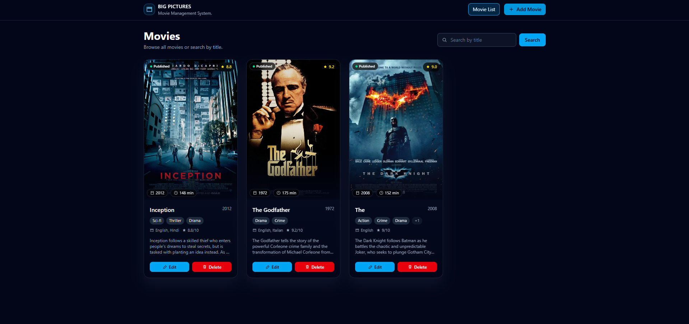

# 🎥 Big Pictures

[](https://nodejs.org/)
[](https://expressjs.com/)
[](https://www.mongodb.com/)
[](https://reactjs.org/)
[](https://vitejs.dev/)
[](https://tailwindcss.com/)
[](https://opensource.org/licenses/ISC)

## 📖 Description

Welcome to **Big Pictures**! 🎬 This is a comprehensive full-stack movie management system designed to empower movie enthusiasts and collectors to effortlessly manage their personal film libraries. With intuitive features, users can add new movies to their collection, complete with detailed information such as titles, descriptions, genres, release dates, and high-quality poster images. The system allows seamless viewing of all stored movies in an organized list, making it easy to browse and discover favorites. Editing movie details is straightforward, enabling users to update information as needed, while the delete functionality ensures a clean and clutter-free collection. Advanced search capabilities let users quickly find movies by title, genre, or other criteria, enhancing the overall user experience. The application boasts a sleek, responsive frontend built with React and Vite for lightning-fast performance and modern UI design, paired with a robust backend powered by Node.js, Express, and MongoDB for reliable data storage and API handling. Perfect for movie lovers who want to organize, track, and enjoy their favorite films in one convenient place! 🍿✨

## 🌟 Features

- 🎥 **Add Movies**: Easily add new movies with details like title, description, and poster images.
- 📋 **View Movies**: Browse a list of all movies with detailed information.
- ✏️ **Edit Movies**: Update movie details seamlessly.
- 🗑️ **Delete Movies**: Remove movies from the collection.
- 🔍 **Search Movies**: Quickly find movies by title or other criteria.
- 📸 **Image Upload**: Upload and manage movie posters.
- 📱 **Responsive Design**: Optimized for desktop and mobile devices.
- 🚀 **Fast Development**: Built with Vite for lightning-fast builds and hot reloading.

## 📹 App Showcase - GIF


## 📸 App Showcase - Image



## 🛠️ Tech Stack

### Backend 🖥️

| Technology     | Description                                                                             |
| -------------- | --------------------------------------------------------------------------------------- |
| **Node.js**    | JavaScript runtime for server-side development, enabling scalable backend applications. |
| **Express.js** | Web framework for building robust APIs with minimal overhead.                           |
| **MongoDB**    | NoSQL database for flexible and scalable data storage.                                  |
| **Mongoose**   | ODM for MongoDB, simplifying database interactions.                                     |
| **Multer**     | Middleware for handling file uploads efficiently.                                       |
| **CORS**       | Enabling cross-origin requests for seamless API communication.                          |
| **Dotenv**     | Environment variable management for secure configuration.                               |

### Frontend 💻

| Technology           | Description                                                    |
| -------------------- | -------------------------------------------------------------- |
| **React**            | Library for building dynamic and interactive user interfaces.  |
| **Vite**             | Fast build tool for modern web development with hot reloading. |
| **Tailwind CSS**     | Utility-first CSS framework for rapid UI development.          |
| **Axios**            | HTTP client for making API requests with ease.                 |
| **React Router DOM** | Declarative routing for React applications.                    |

## 🚀 Installation

Follow these steps to set up the project locally. 🛠️

### Prerequisites

- Node.js (v14 or higher) 📦
- MongoDB (local or cloud instance) 🗄️
- Git 🐙

### Backend Setup

1. Clone the repository:

   ```bash
   git clone https://github.com/your-username/movie-management-system.git
   cd movie-management-system/backend
   ```

2. Install dependencies:

   ```bash
   npm install
   ```

3. Create a `.env` file in the `backend` directory and add your environment variables:

   ```
   PORT=<PORT NUMBER>
   MONGODB_URI=<MONGODB_URI>
   ```

4. Start the backend server:
   ```bash
   npm run dev
   ```

### Frontend Setup

1. Navigate to the frontend directory:

   ```bash
   cd ../frontend
   ```

2. Install dependencies:

   ```bash
   npm install
   ```

3. Start the development server:

   ```bash
   npm run dev
   ```

4. Open your browser and visit `http://localhost:5173` 🌐

## 📚 Usage

1. **Add a Movie**: Click on "Add Movie" and fill in the details. 📝
2. **View Movies**: Browse the movie list on the homepage. 👀
3. **Edit a Movie**: Click on a movie to edit its details. ✏️
4. **Delete a Movie**: Remove unwanted movies from your collection. 🗑️
5. **Search Movies**: Use the search bar to find specific movies. 🔍

## 🔗 API Endpoints

The backend provides the following RESTful API endpoints:

- `GET /api/movies` - Get all movies 📋
- `GET /api/movies/:id` - Get a specific movie by ID 🎥
- `POST /api/movies` - Add a new movie ➕
- `PUT /api/movies/:id` - Update a movie ✏️
- `DELETE /api/movies/:id` - Delete a movie 🗑️
- `GET /api/movies/search?q=query` - Search movies 🔍

## 🤝 Contributing

We welcome contributions! 🎉 Follow these steps:

1. Fork the repository. 🍴
2. Create a new branch: `git checkout -b feature/your-feature-name` 🌿
3. Make your changes and commit: `git commit -m 'Add some feature'` 💾
4. Push to the branch: `git push origin feature/your-feature-name` 🚀
5. Submit a pull request. 📝

## 📄 License

This project is licensed under the ISC License. See the [LICENSE](LICENSE) file for details. 📜

## 👨‍💻 Author

**Rohit Pakhre** - [Your GitHub Profile](https://github.com/Rohit-Pakhre09) 📧

## 🙏 Acknowledgments

- Thanks to the open-source community for amazing tools! 🌟
- Special shoutout to React, Node.js, and MongoDB teams. 👏

---

Enjoy managing your movie collection with **Big Pictures**! 🎥🍿 If you have any questions or suggestions, feel free to open an issue. 💬
