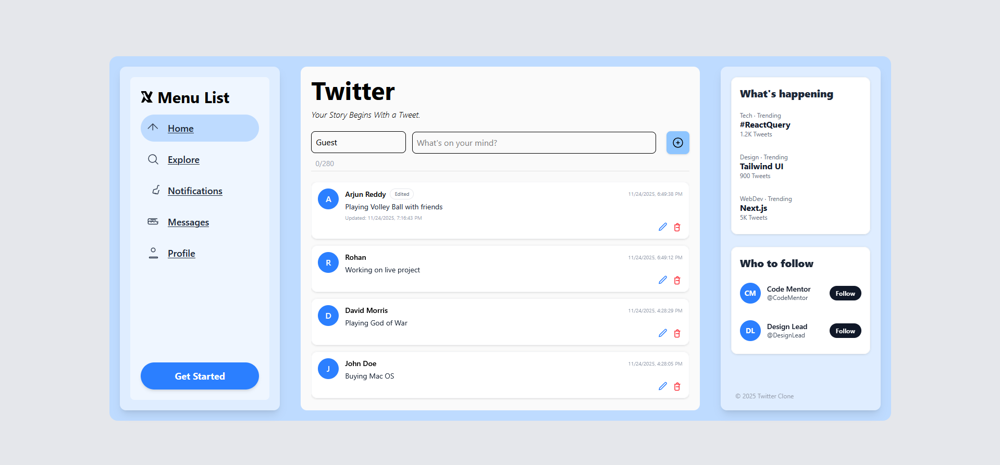
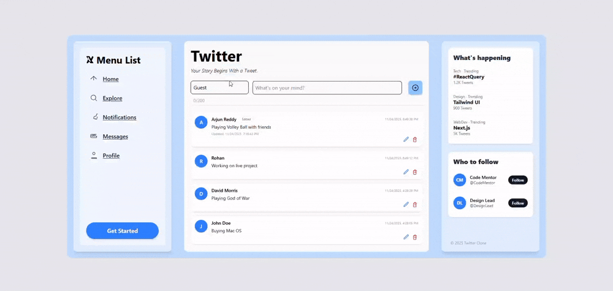

# Twitter Clone API & Web App

[](https://nodejs.org/)
[](https://reactjs.org/)
[](https://expressjs.com/)
[](https://tailwindcss.com/)
[](https://axios-http.com/)
[](https://github.com/expressjs/morgan)
[](https://github.com/expressjs/cors)

Welcome to the **Twitter Clone** project! 🚀 This full-stack web application is designed to deliver a streamlined and intuitive social media experience similar to Twitter. It is built with modern, high-performance technologies including React for the frontend, powered by Vite for lightning-fast development and optimized builds, and Express.js for a flexible and robust backend API.

This project allows users to view, create, and manage tweets seamlessly, featuring a clean, responsive UI styled with TailwindCSS. The backend includes essential middleware such as Morgan for detailed request logging and CORS to securely manage cross-origin resource sharing.

Whether you are exploring full-stack development or looking to build a social media platform, this project offers a solid foundation with scalable architecture and developer-friendly tooling.

## 📸 Sneak Peek



## 🎥 App Showcase



## ✨ Features

- **📝 Tweet Management**: View, post, and manage tweets seamlessly through a user-friendly interface.
- **⚛️ Modern React Frontend**: Developed with React 19.2 and Vite for blazing fast development experience and optimized production builds.
- **🔗 Axios Integration**: Powerful HTTP client handling asynchronous requests with ease and error handling.
- **📊 Detailed Logging**: Comprehensive request logging using Morgan middleware for easy debugging and monitoring.
- **🔒 Security & CORS**: Enhanced security with CORS middleware for controlled cross-origin resource sharing.
- **🎨 TailwindCSS Styling**: Utilizes TailwindCSS for a modern, sleek, and customizable UI that is easy to extend.
- **🛠️ Developer Friendly**: ESLint and Prettier configurations included to maintain code quality and consistency.
- **📂 Organized Code Structure**: Logical project architecture for easy navigation and onboarding new contributors.

## Tech Stack

| Category            | Technology       | Version/Description    |
| ------------------- | ---------------- | ---------------------- |
| **Frontend**        | React, Vite      | React 19.2, Vite       |
| **Backend**         | Node.js, Express | Express 5.1.0          |
| **HTTP Client**     | Axios            | 1.13.2                 |
| **Middleware**      | Morgan, CORS     | Request Logging & CORS |
| **Styling**         | TailwindCSS      | 4.1.17                 |
| **Package Manager** | pnpm             | Latest                 |

## 🚀 Installation

1. **Clone the repository** 📥:

   ```bash
   git clone https://github.com/your-username/twitter.git
   cd twitter
   ```

2. **Install dependencies** with pnpm 📦:

   ```bash
   pnpm install
   ```

3. **Start the development server** ▶️:

   ```bash
   pnpm run dev
   ```

4. **Open the app**:

   Visit `http://localhost:5173` in your browser to use the frontend React app.

## API Endpoints

The backend server exposes API routes under `/api` prefix (default port 3000):

| Method | Endpoint      | Description      |
| ------ | ------------- | ---------------- |
| GET    | `/api/tweets` | Get all tweets   |
| POST   | `/api/tweets` | Post a new tweet |

(The endpoints may vary; consult source code for details.)

## Usage

- The React frontend consumes the backend API using Axios to display and post tweets.
- Customize and extend the app by editing files under `src/` and `src/server/`.

## 🤝 Contributing

Contributions are welcome! Please fork the repository and submit a pull request with improvements or bug fixes.

## 📄 License

This project is licensed under the ISC License - see the [LICENSE](LICENSE) file for details.

## 👨‍💻 Author

[Rohit Pakhre](https://github.com/your-username)
